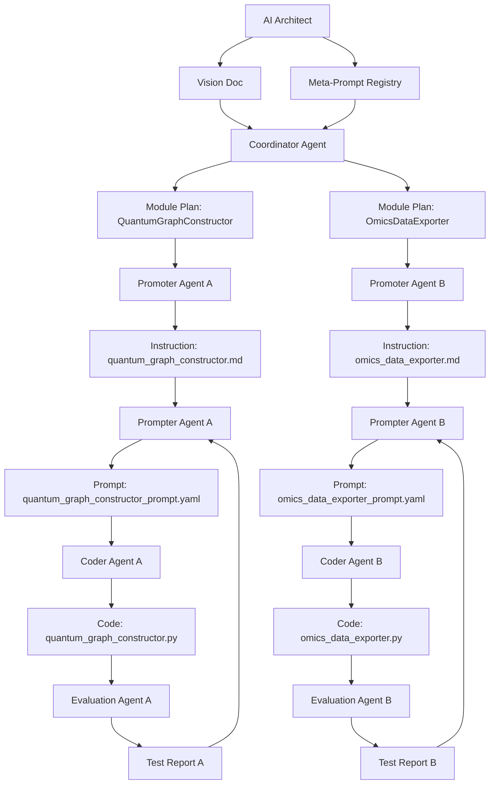

# 🧬 Quantum Virtual Omics (QVO) Project

### *Using AI to Build AI*

A Multi-Agent Framework for Engineering the Digital Omics Simulation Platform

## 🌐 Project Overview

The QVO platform models dynamic omics processes as perturbation trajectories on quantum graphs. The system is being constructed not by hand, but by a recursive network of AI agents writing, testing, and refining every component of the architecture autonomously.

## 🧱 Multi-Agent Development Architecture

| Layer | Role                         | Description                                     |
|-------|------------------------------|-------------------------------------------------|
| 0     | AI Architect                 | Vision, meta-prompts, component ontology       |
| 1     | Coordinator Agent            | Module breakdown, dependencies, task assignment |
| 2     | Promoter Agents              | Write module specifications                    |
| 3     | Prompter Agents              | Generate structured prompts                    |
| 4     | Coder Agents                 | Code modules from prompts                      |
| 5     | Evaluation & Feedback Agents | Test, score, refine modules                    |

## 🔄 Recursive Feedback Workflow



## 📁 Folder Structure

```
qvo_project/
├── architect/
│   ├── qvo_vision_doc.md
│   ├── design_manifest.yaml
│   └── meta_prompt_registry.json
├── coordinator/
│   ├── component_plan.yaml
│   ├── workflow_map.svg
│   └── agent_assignment.json
├── promoters/
│   └── instructions/
│       ├── quantum_graph_constructor.md
│       └── pathway_template_loader.md
├── prompters/
│   └── prompts/
│       ├── quantum_graph_constructor_prompt.yaml
│       └── omics_data_exporter_prompt.yaml
├── coders/
│   └── src/qvo/
│       ├── quantum_graph_constructor.py
│       ├── omics_data_exporter.py
│       └── code_trace_log.json
├── evaluators/
│   └── tests/
│       └── test_quantum_graph_constructor.py
├── feedback/
│   ├── refactor_pathway_template_loader.md
│   └── evaluation_report.md
├── shared_memory/
│   └── chroma_vector_store/
└── README.md
```

## ⚙️ Toolchain and Stack

| Purpose              | Tools                                   |
|----------------------|------------------------------------------|
| Prompting            | LangChain, LangGraph                     |
| Code Generation      | GPT-4, Codex                             |
| Simulation Logic     | NumPy, SciPy, Qiskit                     |
| Evaluation & Logging | LangSmith, Phoenix                       |
| Vector Memory        | ChromaDB, FAISS                          |

## 🚀 Why QVO Matters

This repository showcases a fully autonomous software development stack — where AI agents design, implement, test, and evolve the core components of an omics simulation engine. QVO is a pioneering step in quantum-biological simulation — not just in what it does, but in how it’s being built.